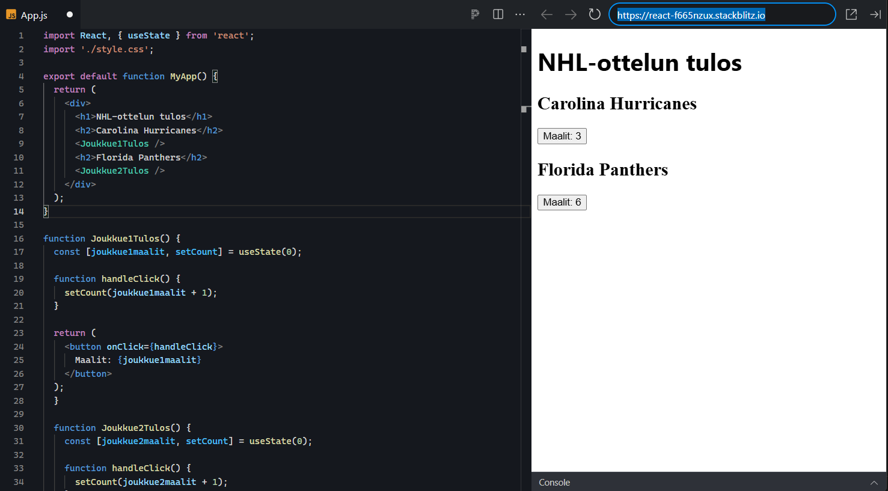
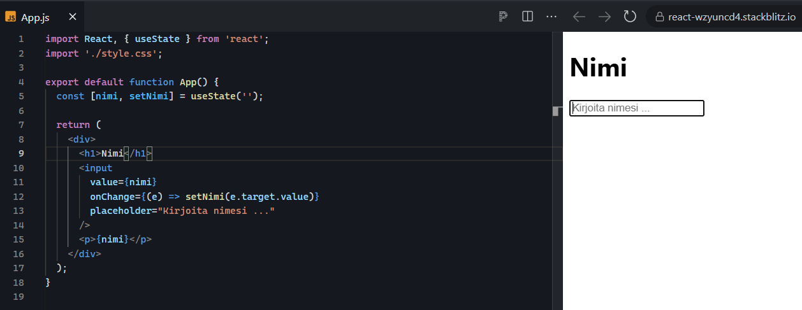
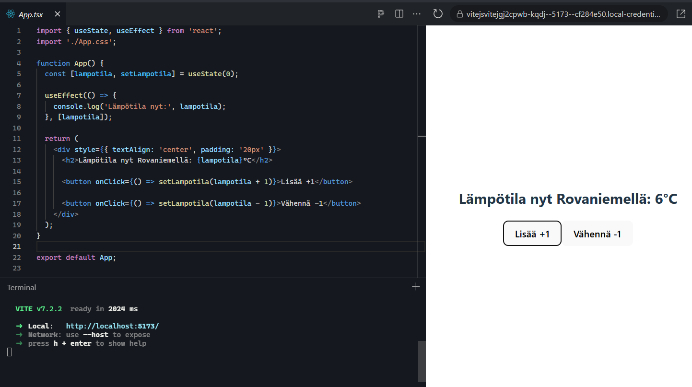
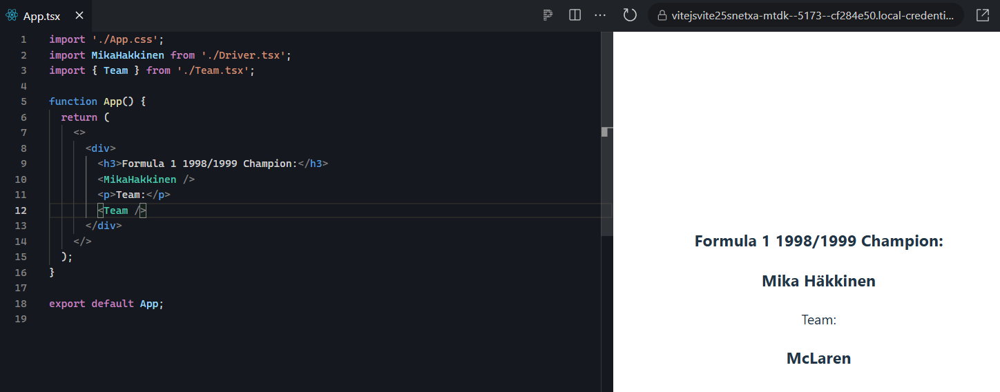
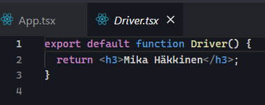
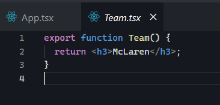
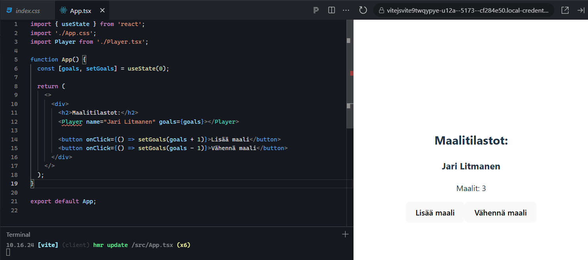
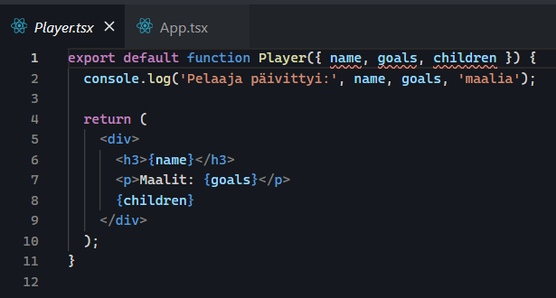
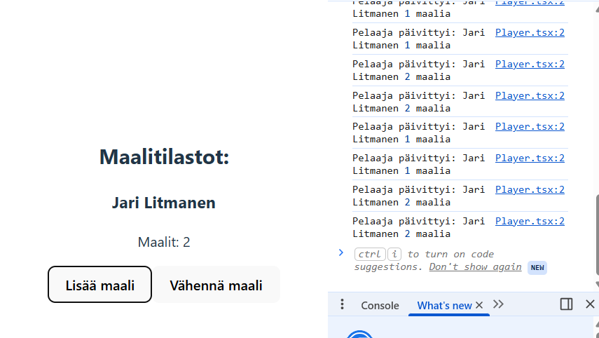

**Tehtävä sarja 2**

Tehtävä 1 ja 2

https://react-f665nzux.stackblitz.io

Katsoin Reactin dokumentoinnin etusivulta esimerkkejä ja niiden mukaisesti tein koodin. Huomasin vasta toisen tehtävän kohdalla, että ensimmäisestä tehtävästä tuli hieman laajempi ja se kattoi toisenkin tehtävän tavoitteet jos ymmärsin oikein.

Tehtävä 3

https://react-wzyuncd4.stackblitz.io

Katsoin Reactin dokumentoinnista esimerkkejä, mutta en täysin ymmärtänyt ja kysyin Grokilta lisätietoja.

Ymmärsin asian niin, että controlled on parempi reaaliaikaisiin tehtäviin ja uncontrolled sellaisiin, joissa voi olla pieni viive. Koodissa käytetyn controlledin vuoksi Reactin tilanhallinta reagoi jokaiseen painallukseen input-kentässä eli jos lomake on suuri se voi hieman hidastua. Uncontrolledissa DOM hallitsee tilaa ja React lukee vain tarvittaessa arvot eli se on nopeampi koska on vähemmän renderöintiä.

Tehtävä 4

https://vitejsvitejgj2cpwb-kqdj--5173--cf284e50.local-credentialless.webcontainer.io

Luin Reactin dokumentaatiosta useEffectin teoriaosuuden ja esimerkit. Sen jälkeen vielä kysyin Grokilta lisätietoja ja kertomaan yksinkertaisemmin asiasta.

- useEffect hookia käytetään yleensä kun jotain halutaan tehdä renderöinnin jälkeen kuten hakea dataa netistä, tallentaa jotain selaimeen tai käynnistää ajastin. 

- React 19 tekee joistakin useEffectin tapauksista automaattisia eli useEffectiä ei niissä tapauksissa tarvitse käyttää.

- useEffect { ... } sisälle se mitä tehdään kun tila muuttuu, se voi olla console.log tai mitä vaan muuta. Sen jälkeen otetaan [riippuvuudet] sulkujen sisälle kaikki riippuvuudet, eli jos jotain muuttuu tässä kohtaa niin efekti suoritetaan uudelleen

- kun komponentti poistuu suoritetaan siivous, eli jos esimerkiksi katkaistaan yhteys lisätään return, jonka sisällä suoritetaan yhteyden katkaisu:

return () => {
    socket.close();   
  };

Tehtävä 5

https://vitejsvite25snetxa-mtdk--5173--cf284e50.local-credentialless.webcontainer.io

App.tsx

Driver.tsx

Team.tsx

Tehtävässä katsoin teoria tältä sivulta: https://www.w3schools.com/react/react_es6_modules.asp

Sen lisäksi kysyin myös lisätietoja Grok-tekoälyltä ymmärtääkseni export default functionin ja export functionin välillä. 

Tein Driver ja Team tiedostot, jotka importtasin App.tsx:ssä. Eli export default function tuo yhden asian tiedostosta ja sen voi nimetä miten vain. Vaikka se oli nimetty alunperin export default function Driver(), Driverin sijaan ei ole väliä mitä sen tilalle kirjoittaa ja sen takia käytinkin tätä funktiota App.jsx:ssä nimellä MikaHakkinen. Se on default funktio ja ymmärsin niin, että yhdessä tiedostossa voi olla vain yksi default funktio ja sitä voi käyttää missä vain toisessa tiedostossa importatessa ja nimetä se miten vain.

Export functionin nimen pitää taas täsmätä täysin. Eli jos tiedostossa on useita funktioita niin kaikilla pitää olla eri nimi ja importatessa niiden täytyy täsmätä.

Esimerkkikoodi oli lyhyt, koska uskoin ymmärtäneeni jo periaatteen. Koodista olisi saanut hieman paremman jos olisi vaikka luonut export functionin, jossa Driver tai Team ottaa useita parametrejä esim: 

export function Driver( {name, team, points} )

Tehtävä 6

Kävin läpi kaikki teoriat W3Schools ja Reactin omilta sivuilta liittyen aiheeseen.

Lähteet: 
https://www.w3schools.com/react/react_props.asp
https://react.dev/learn/passing-props-to-a-component

https://vitejsvite9twqypye-u12a--5173--cf284e50.local-credentialless.webcontainer.io

Parent-komponentti

Aluksi maalien määrä on 0
Lisää maali tai vähennä nappia painamalla child-komponentin tila muuttuu

Child-komponentti

Child-komponentti päivittyy aina kun parent-komponentin tila muuttuu nappeja painamalla ja silloin näemme console.log viestin

Console.log viestit

Tässä näkyy console.log viestit kun painamme Parent-komponentin nappeja. 

Tehtävä 7